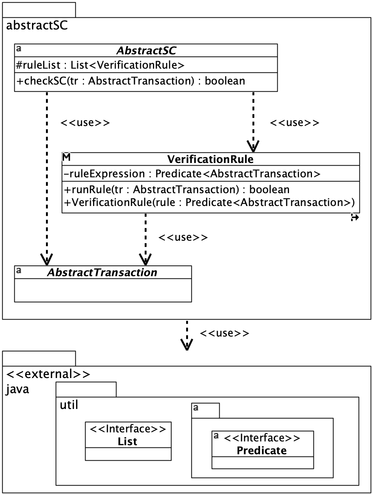
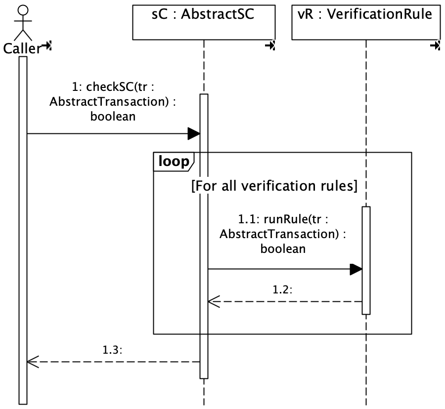
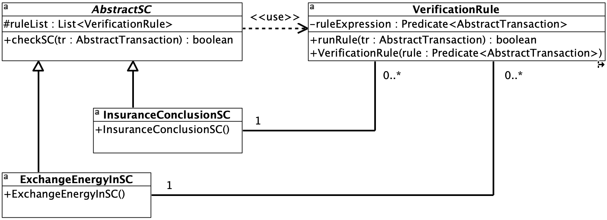
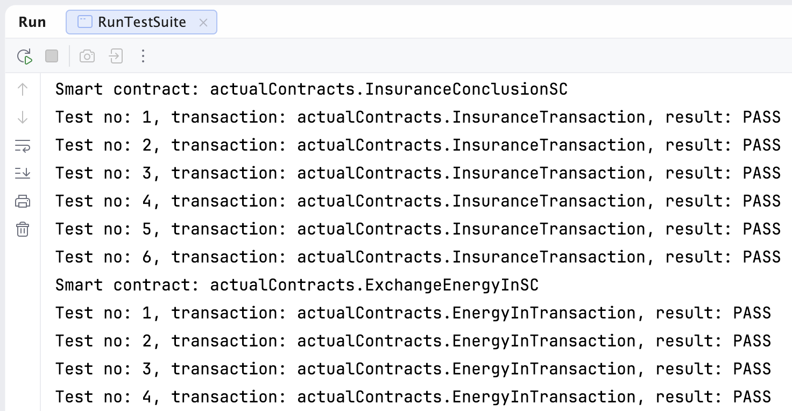

# AbstractSC

This software package implements the AbstractSC smart contract design pattern to verify a single transaction type. It provides a standardized approach to transaction validation within a smart contract. Explicitly declaring a verification rule class in the abstract layer guarantees its complete reusability across all implemented smart contracts.

## The package structure

The package structure includes the abstract layer, which is a reusable component that can be utilized in smart contract development projects.

The abstract layer of the AbstractSC package consists of the following classes:
* ``AbstractSC`` class --- the abstract class of a smart contract that verifies a single transaction type.
* ``VerificationRule`` class --- the concrete, final class for a verification rule in a smart contract.
* ``AbstractTransaction`` class --- the abstract class of a general transaction.

The transaction verification function is implemented in the abstract layer. This way, the software exposes a uniform interface while hiding the business logic of actual smart contracts. The concrete class ``VerificationRule`` is marked as final, which prevents further inheritance. It also prevents its methods from being overridden. This ensures that the rule validation mechanism implemented in the ``runRule()`` method functions consistently across all concrete verification rules.

## Package classes

The figure below shows the UML class diagram featuring the abstract classes in the AbstractSC package.

  

## Checking transactions

The figure below shows the UML Sequence diagram for the ``checkSC()`` method invocation in the abstract layer.

  

The ``checkSC()`` method sequentially checks each verification rule object contained in the ``ruleList`` instance variable. The method returns TRUE only if all rules are successfully validated. If any rule evaluates to FALSE, the ``checkSC()`` method aborts the transaction validation process and returns FALSE.

## Illustrative examples

The package provides examples of two different smart contracts: ``ExchangeEnergyInSC`` and ``InsuranceConclusionSC``. The first smart contract verifies energy exchange transactions between prosumers in a renewable energy community, while the second one validates transactions involved in concluding an insurance contract.

The figure below presents the UML Class diagram depicting the inheritance hierarchy of example smart contracts.

  

The ``ExchangeEnergyInSC`` smart contract class uses three verification rules:
* ``Source differs from target`` --- the verification rule that checks whether the source and the target are different,
* ``Quantity greater than zero`` --- the verification rule that checks whether the energy quantity is greater than zero,
* ``Source surplus greater than or equal to the quantity`` --- the verification rule that checks whether the source surplus is greater than or equal to the energy quantity.

The second concrete smart contract class ``InsuranceConclusionSC`` enforces the following five verification rules:
* ``Correct insurance contract date`` --- the verification rule that checks whether the insurance contract date is no earlier than the current day,
* ``Non-zero insurance contract length`` --- the verification rule that checks whether the contract end date is later than the contract start date,
* ``Positive insurance contract amount`` --- the verification rule that checks whether the value of the insurance contract is positive,
* ``Positive insurance contract premium`` --- the verification rule that checks whether the premium of the insurance contract is positive,
* ``Premium lower than the insurance amount`` --- the verification rule that checks whether the insurance contract premium is lower than the insurance contract amount.

In the smart contract class constructors, you need to instantiate objects for the considered verification rules and place them in the ``ruleList`` instance variable.

Each of the smart contracts under consideration verifies a different type of transaction.
The ``InsuranceConclusionSC`` smart contract class verifies the ``InsuranceTransaction`` class, while the ``ExchangeEnergyInSC`` smart contract class examines the ``EnergyInTransaction`` class. These concrete transaction types are not logically related to each other.

## Tests

The tests were prepared and conducted according to the ``k+1`` test suite reduction method. The ``SmarTS`` software package was used to implement the test classes. In particular, the ``AbstractTestSC`` abstract test class was utilized from the second version of that package. Following the ``k+1`` testing approach, a smart contract with k verification rules requires the creation of k+1 test transactions. One test transaction includes valid values for all verification rules. The remaining k transactions each have valid values for k-1 rules but contain a single incorrect value for one specific verification rule. In each of these k test transactions, a different parameter is intentionally set to an incorrect value to test each verification rule separately.
There are 3 verification rules in the ``ExchangeEnergyInSC`` smart contract. Therefore, a total of 4 test transactions had to be prepared.
Regarding the ``InsuranceConclusionSC`` smart contract, there are 5 verification rules. Therefore, a total of 6 test transactions had to be prepared.

## Running the Example

The package and example were implemented in IntelliJ IDEA Community Edition.

To test both smart contracts, run the ``RunTestSuite`` class.

The figure below shows the results of executing the test suite for both smart contracts.

  

